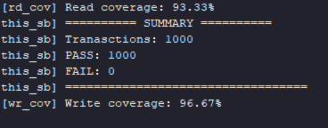
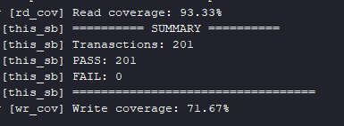

# AXI4-Lite Slave Verification Environment (UVM Testbench + RAL)

This project implements a UVM-based verification environment for an AXI4-Lite slave exposing a four-register file. It follows the standard UVM layered architecture (sequence, sequencer, driver, monitor, scoreboard, coverage, assertions) with three parallel agents coordinated through a virtual sequencer, and adds a full **Register Abstraction Layer** on top: a register model, a custom frontdoor, two bus adapters, and two predictors.

The environment provides **two independent ways of exercising the same DUT**, both running against the same components:

- **`AXI4Lite_test`** — constrained-random regression: 1000 transactions of write/read/IRQ traffic generated concurrently, checked by a hand-written scoreboard, measured by functional coverage. This is the same methodology as the earlier FIFO and ALU projects.
- **`AXI4Lite_ral_test`** — register-level verification through RAL: the built-in `uvm_reg_hw_reset_seq` and `uvm_reg_bit_bash_seq`, plus a directed sequence that verifies reserved-bit behaviour and full write-1-to-clear semantics on the interrupt register.

The two are complementary rather than redundant. Random regression finds timing and protocol corner cases that nobody anticipated; the RAL test verifies specific documented properties — reset values, access policies, W1C behaviour — each with a single known-correct answer. Both run through the same drivers and monitors, so the scoreboard validates the register accesses too, giving two independent checkers on every transaction.

## Design Under Test (DUT)

### The protocol

AXI4-Lite is the simplified, single-transfer subset of AMBA AXI. It has **five independent channels**, each using the same VALID/READY handshake: the source asserts `VALID` when it has something to send, the destination asserts `READY` when it can accept, and the transfer happens on the cycle where both are high.

| Channel            | Signals                              | Purpose               |
| ------------------ | ------------------------------------ | --------------------- |
| Write Address (AW) | `AWADDR`, `AWVALID`, `AWREADY`       | Where to write        |
| Write Data (W)     | `WDATA`, `WVALID`, `WREADY`          | What to write         |
| Write Response (B) | `BRESP`, `BVALID`, `BREADY`          | Did the write succeed |
| Read Address (AR)  | `ARADDR`, `ARVALID`, `ARREADY`       | Where to read         |
| Read Data (R)      | `RDATA`, `RRESP`, `RVALID`, `RREADY` | The data, plus status |

`BRESP` and `RRESP` are two-bit response codes: `OKAY` (`00`), `EXOKAY` (`01`, exclusive access — not supported in AXI4-Lite), `SLVERR` (`10`, the slave understood the request but cannot complete it) and `DECERR` (`11`, generated by an interconnect when no slave owns the address). This slave always returns `OKAY`.

Unlike a FIFO — where the whole interface is `data_in`, `data_out`, `full`, `empty` — the meaning here lives in the _handshake protocol_ and in the _semantics of each register_, not in a couple of status flags. That is what makes the verification interesting: there are rules about signal stability, response bounds, and per-register access policies, none of which are visible from the port list alone.

### `AXI4Lite_slave.v`

Two independent FSMs, one per direction, plus the register file.

**Write FSM (2 states).** Deliberately simplified: a write is accepted only when `AWVALID` and `WVALID` are asserted in the _same_ cycle — address and data arriving on separate cycles is not supported. On acceptance the slave pulses `reg_wr_en` for exactly one cycle, latches address and data, and raises `BVALID`. It returns to idle on the B handshake.

**Read FSM (3 states: IDLE → WAIT → DATA).** The extra `RD_WAIT` state exists to absorb the register file's one-cycle read latency: `reg_rd_en` pulses in one cycle, but `reg_rd_data` only becomes valid the cycle after. Without `RD_WAIT` the slave would drive stale data on `RDATA`. This is the same class of latency handled in the FIFO project's read monitor, here pushed into the RTL instead.

### `AXI4Lite_regfile.v` — the register map

Four 32-bit registers at four-byte-aligned offsets. Each one exists to exercise a _different access policy_, which is the whole point of the register file.

| Offset | Register         | Policy | Contents                                                            |
| ------ | ---------------- | ------ | ------------------------------------------------------------------- |
| `0x0`  | `CTRL_REG`       | RW     | bit 0 `enable`, bits [2:1] `mode`, bits [31:3] reserved (read as 0) |
| `0x4`  | `STATUS_REG`     | RO     | bit 0 `busy`, bits [31:1] reserved                                  |
| `0x8`  | `DATA_REG`       | RW     | full 32-bit scratch register                                        |
| `0xC`  | `IRQ_STATUS_REG` | W1C    | bit 0 interrupt flag, bits [31:1] reserved                          |

**`CTRL_REG`** — an ordinary read/write control register, but only three bits are implemented. Writing `0xFFFFFFFF` must read back as `0x7`: the reserved bits have no storage behind them. This is a real class of RTL bug (accidentally instantiating flip-flops for bits the spec says are reserved) and is checked explicitly.

**`STATUS_REG`** — read-only, and its `busy` bit is driven internally by the MSB of a free-running 4-bit counter. This models a status bit that hardware changes on its own: the testbench cannot predict it, only observe it. Writes to this address must be silently ignored — the register keeps its value, and the slave still returns `OKAY`.

**`DATA_REG`** — a plain 32-bit scratch register with no special behaviour. It is the baseline: whatever is written must read back identically.

**`IRQ_STATUS_REG`** — the most interesting one. It is **write-1-to-clear**: the bit written is a _command_, not data.

| Write value | Meaning    | Effect on a bit that is `1` |
| ----------- | ---------- | --------------------------- |
| `0`         | do nothing | stays `1`                   |
| `1`         | clear it   | becomes `0`                 |

The bit is _set_ by hardware, through the external `irq_set_i` input, which the testbench drives from a dedicated agent. W1C exists so that several independent interrupt handlers can each clear their own bit without a read-modify-write cycle that could lose an interrupt arriving in between.

The RTL also implements **set-wins-over-clear priority**: if `irq_set_i` pulses in the same cycle as a W1C write, the set wins and the clear is dropped. The rationale is that losing a new interrupt event is worse than losing a clear. Modelling this one-cycle race correctly in the scoreboard turned out to be the hardest part of the project (see bug #1).

## Verification architecture

Three agents, because the DUT has three distinct stimulus surfaces:

- **`AXI4Lite_wr_agent`** — drives the AW, W and B channels.
- **`AXI4Lite_rd_agent`** — drives the AR and R channels.
- **`irq_agent`** — drives the sideband `irq_set_i` input.

`AXI4Lite_virtual_sequencer` holds handles to all three real sequencers, so `AXI4Lite_virtual_sequence` can `fork`/`join` the three streams and run them concurrently for the whole test. The same virtual sequencer is later reused by the RAL layer — both by the frontdoor, to reach the right channel per access, and by the register sequence, to pulse `irq_set_i` in the middle of a W1C test.

The interface (`AXI4Lite_inf`) uses three `clocking` blocks (`drv_cb`, `drv_irq_cb`, `mon_cb`) with matching `modport`s, so a driver's virtual-interface handle is typed `virtual AXI4Lite_inf.DRIVER_AXI4Lite` and can only reach `drv_cb` — a compile-time guarantee against a component touching a signal it has no business touching, or bypassing the clocking block's timing skew.

### Scoreboard

The scoreboard subscribes to **five** analysis ports through `uvm_analysis_imp_decl`-generated imps: completed writes, completed reads, the IRQ sideband, the read-address handshake, and an early write-command publication. Three of these exist purely to get the _timing_ right; see bug #1.

Per register it checks:

- `CTRL_REG` / `DATA_REG` — an associative array holds the last written value; reads must match, with `CTRL_REG` masked to its implemented bits.
- `STATUS_REG` — `busy` is hardware-driven and not modelled, so only two things are checked: `RDATA` must not contain X/Z, and bits [31:1] must be zero.
- `IRQ_STATUS_REG` — a cycle-accurate flip-flop model (below).
- unmapped addresses — the spec requires `RDATA = 0`.

### Coverage

Two `uvm_subscriber`-based collectors sample every observed transaction:

- **Write**: `mode` (all four values), `enable`, address (all four registers **plus an `unmapped` bin** covering the twelve unused offsets), the W1C write value, `irq_set_i`, and a cross of `irq_set_i` × W1C write with `ignore_bins` on the three combinations that are not the interesting race — leaving only the simultaneous set-and-clear case as a coverage goal.
- **Read**: `busy` (both polarities), address (same bins including `unmapped`), and the IRQ bit read back as both set and cleared.

## Register Abstraction Layer

The RAL layer models the same four registers as `uvm_reg` classes, each field configured with its real access policy (`"RW"`, `"RO"`, `"W1C"`), reset value, and `volatile` flag.

What made this project's RAL non-standard is that **writes and reads go to two different agents with two different item types**. The usual `reg2bus` adapter path assumes a single sequencer and a single transaction type, which does not fit here. The solution:

- **`AXI4Lite_frontdoor`** (extends `uvm_reg_frontdoor`) — branches on `rw_info.kind`, builds the right item type, and sends it to the right sequencer via `p_sequencer`. It reads the register address from `rw_info.local_map`, fills `rw_info.value[0]` on reads, and maps `BRESP`/`RRESP` to `rw_info.status`. One frontdoor instance per register, because `rw_info` is a class member and a shared instance would be clobbered by concurrent accesses.
- **`AXI4Lite_wr_adapter` / `AXI4Lite_rd_adapter`** — only `bus2reg` is implemented, because with an explicit frontdoor `reg2bus` is never called. Rather than returning an empty item silently, `reg2bus` raises a `uvm_fatal`: if it ever _is_ called, something is misconfigured and that should be loud, not silent.
- **Two `uvm_reg_predictor` instances** — the class is parameterised on a single bus item type, so one instance per item type. Both are connected to the **monitors**, not the drivers: the model must be updated from what actually happened on the wires, including the response code, not from what the testbench intended.

### Important note :

`IRQ_STATUS_REG` is excluded from bit-bash via `uvm_resource_db#(bit)::set(..., "NO_REG_BIT_BASH_TEST", 1)`. The reason is documented in the code: the bit is volatile and hardware can raise it mid-test, which would produce failures that are not DUT bugs. Its W1C behaviour is covered by step 6 and by the scoreboard.

## Real bugs found during development

#### Three IRQ mismatches caused by publication order, not by the DUT

After the scoreboard was otherwise clean, three `IRQ_STATUS_REG` read comparisons out of a thousand transactions failed. Waveform inspection confirmed the DUT was correct at every failing point: `irq_set_i` had not been high anywhere near the failing read, and `irq_status_reg` held the value the read returned.

**Root cause: analysis-item arrival order is not simulation-time order.** The write monitor published its item at the **B-channel handshake** — several cycles _after_ the write had actually committed inside the DUT. The IRQ monitor published its item at the cycle it observed. So the scoreboard received a "write happened" notification well after it had already processed an `irq_set_i` that, in real time, came _later_. The model applied the two events in the wrong order and predicted the wrong value.

An early hypothesis — that the `#1step` input skew in the clocking block was sampling one cycle off — was tested directly and disproved. Another early theory, that the sideband snapshot in the write item was two cycles stale, was also wrong: the RTL showed the AW/W handshake cycle _is_ the `reg_wr_en` cycle.

**Fix, in two parts:**

- The write monitor gained a **second analysis port** (`cmd_wr`) that publishes a minimal command item at the cycle the write commits, independent of the much later B handshake. Ordering information and payload information are now carried by two different publications, each at its correct time.
- The scoreboard's IRQ prediction was rewritten as an explicit **flip-flop model** instead of a single variable:

```systemverilog
logic irq_next;      // D - what will be loaded at the next edge
logic irq_current;   // Q - what is visible this cycle
bit   irq_flag;      // a set occurred in this cycle (set wins over clear)
time  last_time;     // cycle-boundary detection

local function void advance();
    if (last_time != $time) begin
        irq_current = irq_next;
        irq_flag    = 0;
        last_time   = $time;
    end
endfunction
```

Every callback calls `advance()` first, so whichever item arrives first in a given simulation timestep performs the Q ← D transfer, and all items in that timestep then see a consistent view of the cycle. `irq_flag` reproduces the RTL's set-wins-over-clear priority exactly. A fourth port (`addr_port`, published at the AR handshake) snapshots the value the DUT will return for a read, since the read item itself only arrives at the R handshake.

**Result:** 1000 PASS / 0 FAIL.

**Lesson:** when a scoreboard models per-cycle hardware behaviour, the order in which analysis items _arrive_ says nothing about the order in which the events _happened_. Either publish at the moment the event occurs, or carry an explicit timestamp — do not infer time from arrival order.

#### An analysis port with no subscriber fails silently

Immediately after that fix, the run produced 83 failures, all in the same direction. The `uvm_info` messages added inside the new callback never appeared in the log, which narrowed it in one step: the function was never called.

The new `cmd_wr` port existed in the monitor and the matching imp existed in the scoreboard, but the two were **never connected in `AXI4Lite_env`**. In UVM an analysis port has `min_size = 0`, so calling `write()` on a port with zero subscribers is a legal, completely silent no-op — no warning, no error, the data simply goes nowhere.

Fixed by adding the connection, and guarded against the whole class of mistake by checking subscriber counts in `end_of_elaboration_phase` with a `uvm_fatal`. A missing connection now fails loudly at elaboration instead of silently corrupting results at runtime.

#### Assertions: a bound cannot be a property argument

The two bounded-response properties began as one generic property, kept commented at the bottom of `AXI4Lite_assertions.sv`:

```systemverilog
property valid_must_occur_after_addr_data_accepted(logic accepted, logic VALID);
    @(posedge ACLK) disable iff(!ARESETN)
    accepted |-> ##[0:MAX_RESP_CYC] VALID;
endproperty
```

The intention was to pass the bound in as a third argument, so a single property could serve both channels. The simulator rejected it: a cycle-delay range must be an elaboration-time constant, and a property formal is not one. Signals can be arguments; a number of cycles cannot.

That forced a split into `bvalid_bounded` and `rvalid_bounded` with two separate `localparam`s — which turned out to be the correct answer regardless, because the two bounds genuinely differ: `BVALID` appears 1 cycle after a write is accepted, `RVALID` 2 cycles after a read address is accepted, because of the `RD_WAIT` state. A single shared bound would have been either too permissive on B or a false failure on R.

Two other structures in that file exist for the same reason — a property alone could not express what was needed:

- **Stability is precomputed, not checked inside the property.** Each payload is shadowed in a registered copy (`awaddr_q`, `wdata_q`, …), compared in a `wire`, and the resulting flag is passed into `no_change_until_handshake_finishes` as an argument.
- **"No response without a request" needs memory**, which a property does not have. `wr_pending` and `rd_pending` are maintained as small state machines inside the checker — set on the request handshake, cleared on the response handshake — so the assertion reduces to `BVALID |-> wr_pending`.

The same commit also fixed a simulation that never terminated: an unbounded or never-satisfied response property leaves a thread pending indefinitely, which with `run -all` keeps the run phase alive forever. Bounding both response properties removed it.

## SystemVerilog Assertions

`Testbench/AXI4Lite_assertions.sv` holds 27 concurrent assertions, attached to `AXI4Lite_slave` via `bind` so the RTL is never modified. They are written as **parameterised properties** instantiated per channel rather than as 27 hand-written copies — a `VALID`-stability property, for instance, is written once and asserted five times.

Grouped by what they protect:

- **Handshake integrity** — `VALID` may not be deasserted before the matching `READY` is seen, on all five channels.
- **Payload stability** — `AWADDR`, `WDATA`, `BRESP`, `ARADDR`, `RDATA`, `RRESP` may not change while their `VALID` is high and `READY` is still low.
- **Definedness** — no payload may contain X/Z while its `VALID` is active.
- **Bounded response** — `BVALID` must appear within 1 cycle of a write being accepted, `RVALID` within 2 cycles of a read address being accepted (2, because of the `RD_WAIT` state).
- **No unsolicited responses** — locally tracked `wr_pending` / `rd_pending` flags ensure `BVALID`/`RVALID` never assert without an outstanding request.
- **Reset behaviour** — all five output handshake signals must be low during reset.
- **Response code** — `BRESP` and `RRESP` must be `OKAY` whenever their `VALID` is active.

## Testbench validation via mutation testing

Following the methodology of the [ALU](https://github.com/DanielCazacu25/UVM_based_ALU_testbench) and FIFO projects, the checkers were validated by deliberately breaking the RTL and confirming the failure is caught.

**W1C removed from `AXI4Lite_regfile.v`** — the write-1-to-clear branch was deleted, so the interrupt bit could be set but never cleared. The scoreboard reported **33 errors**, confirming that the cycle-accurate IRQ model built for bug #1 genuinely detects a wrong clear and is not passing by coincidence.

The assertion layer was validated the same way in the earlier phase of the project.

## Known limitations

**The DUT returns `OKAY` for writes to read-only registers and for unmapped addresses.** It never generates `SLVERR`. This is arguably a specification gap rather than an implementation bug — the specification does not define the behaviour for unmapped accesses — but it means the slave silently tells a master that a write succeeded when it had no effect. Both the coverage collectors have `unmapped` address bins, so these accesses are measured; the assertion layer explicitly expects `OKAY`, which encodes the current behaviour rather than checking it.

## Project structure

| Folder/File                                                                                                         | Description                                                                       |
| ------------------------------------------------------------------------------------------------------------------- | --------------------------------------------------------------------------------- |
| `Design/AXI4Lite_slave.v`                                                                                           | AXI4-Lite slave: write FSM, read FSM, register-file instance                      |
| `Design/AXI4Lite_regfile.v`                                                                                         | The four registers and their access policies                                      |
| `Testbench/AXI4Lite_pkg.sv`                                                                                         | Package including all UVM class files, in dependency order                        |
| `Testbench/AXI4Lite_inf.sv`                                                                                         | Interface: signals, 3 clocking blocks, 3 matching modports                        |
| `Testbench/AXI4Lite_wr_item.sv` / `AXI4Lite_rd_item.sv` / `irq_seq_item.sv`                                         | Transaction classes                                                               |
| `Testbench/AXI4Lite_wr_sequencer.sv` / `AXI4Lite_rd_sequencer.sv` / `irq_sequencer.sv`                              | Sequencers                                                                        |
| `Testbench/AXI4Lite_virtual_sequencer.sv`                                                                           | Holds handles to all three real sequencers                                        |
| `Testbench/AXI4Lite_wr_seq.sv` / `AXI4Lite_rd_seq.sv` / `irq_seq.sv`                                                | Constrained-random stimulus sequences                                             |
| `Testbench/AXI4Lite_virtual_sequence.sv`                                                                            | Runs the three sequences concurrently via `fork`/`join`                           |
| `Testbench/AXI4Lite_wr_driver.sv` / `AXI4Lite_rd_driver.sv` / `irq_driver.sv`                                       | Drivers                                                                           |
| `Testbench/AXI4Lite_wr_monitor.sv` / `AXI4Lite_rd_monitor.sv` / `irq_monitor.sv`                                    | Monitors (the write monitor publishes on two ports, see bug #1)                   |
| `Testbench/AXI4Lite_wr_agent.sv` / `AXI4Lite_rd_agent.sv` / `irq_agent.sv`                                          | Agents                                                                            |
| `Testbench/AXI4Lite_scoreboard.sv`                                                                                  | Five-port scoreboard with the cycle-accurate IRQ model                            |
| `Testbench/AXI4Lite_wr_coverage.sv` / `AXI4Lite_rd_coverage.sv`                                                     | Functional coverage collectors                                                    |
| `Testbench/AXI4Lite_ctrl_reg.sv` / `AXI4Lite_status_reg.sv` / `AXI4Lite_data_reg.sv` / `AXI4Lite_irq_status_reg.sv` | `uvm_reg` classes, one per register                                               |
| `Testbench/AXI4Lite_reg_block.sv`                                                                                   | `uvm_reg_block`: creates the registers, builds the address map, `lock_model()`    |
| `Testbench/AXI4Lite_wr_adapter.sv` / `AXI4Lite_rd_adapter.sv`                                                       | `bus2reg` for the predictors; `reg2bus` raises `uvm_fatal` by design              |
| `Testbench/AXI4Lite_frontdoor.sv`                                                                                   | Custom frontdoor routing register accesses to the correct agent                   |
| `Testbench/AXI4Lite_ral_seq.sv`                                                                                     | Register test: built-in sequences plus directed reserved-bit and W1C checks       |
| `Testbench/AXI4Lite_env.sv`                                                                                         | Environment: agents, scoreboard, coverage, register model, predictors, frontdoors |
| `Testbench/AXI4Lite_test.sv`                                                                                        | Random regression test                                                            |
| `Testbench/AXI4Lite_ral_test.sv`                                                                                    | Register-level test                                                               |
| `Testbench/AXI4Lite_top.sv`                                                                                         | Clock generation, reset, interface, DUT instance, `run_test()`                    |
| `Testbench/AXI4Lite_assertions.sv`                                                                                  | Black-box SVA, attached via `bind` (no RTL modification)                          |

## How to run

1. Open Vivado and create a new project.
2. Add both files under `Design/` as design sources.
3. Add **only** these as simulation sources: `Testbench/AXI4Lite_inf.sv`, `Testbench/AXI4Lite_assertions.sv`, `Testbench/AXI4Lite_pkg.sv`, `Testbench/AXI4Lite_top.sv`.
   - **Important:** do _not_ add the individual class files. They are pulled in through `` `include `` inside `AXI4Lite_pkg.sv`. Adding them separately makes the simulator compile each one twice — once standalone, once inside the package — and the standalone copy cannot see anything declared at package level, which shows up as `'RESP_OKAY' is not declared` in the adapters.
4. Set the simulation top module to `AXI4Lite_top`.
5. Select the test:

   ```tcl
   set_property -name {xsim.simulate.xsim.more_options} \
                -value {-testplusarg UVM_TESTNAME=AXI4Lite_test} \
                -objects [get_filesets sim_1]
   ```

   Replace with `AXI4Lite_ral_test` for the register-level test.

6. Run behavioral simulation. Vivado stops at its default 1000 ns, which is far short of what either test needs.
7. Type `run -all` in the Tcl console so the simulation runs until UVM itself calls `$finish`.
8. Check the Tcl console for the scoreboard summary, the coverage percentages, and the UVM report summary (`UVM_ERROR` / `UVM_FATAL` counts).

## Regression script

`scripts/script.py` runs both tests (`AXI4Lite_test` and `AXI4Lite_ral_test`) on N random seeds from the command line, without opening the Vivado GUI, and writes a pass/fail summary plus a log of every failure.

### Requirements

- Windows (the script calls `settings64.bat` through `cmd`)
- Vivado with the Vivado Simulator (`xsim`); tested with 2025.2
- Python 3 (standard library only, nothing to install)
- The behavioral simulation must have been run **once from Vivado** (see _How to run_). That step compiles and elaborates the design into the snapshot `AXI4Lite_top_behav`, which the script then re-runs. Both tests live in the same snapshot, so switching tests or seeds needs no recompilation.
  > After editing any `.sv` / `.v` file, run the simulation from Vivado once more. Otherwise the script keeps running the old snapshot.

### Finding the two paths

| Argument     | What it points to                                                     | Where to find it                                       |
| ------------ | --------------------------------------------------------------------- | ------------------------------------------------------ |
| `--folder`   | The folder that holds the compiled snapshot (it contains `xsim.dir/`) | `<project>/<project>.sim/sim_1/behav/xsim`             |
| `--settings` | Vivado's environment script, which puts `xsim` on the `PATH`          | `<Vivado install dir>/<version>/Vivado/settings64.bat` |

* Note: instruction on how to find the folder and settings64 file, as well as how to set the command in cmd can be found in the `instructions` folder.

### Usage

```
cd scripts
python script.py --number 100 --folder "<path to xsim folder>" --settings "<path to settings64.bat>"
```

| Argument     | Default             | Meaning                                                                             |
| ------------ | ------------------- | ----------------------------------------------------------------------------------- |
| `--number`   | `10`                | Number of seeds. Each seed runs both tests, so `--number 100` means 200 simulations |
| `--folder`   | author's local path | See the table above                                                                 |
| `--settings` | author's local path | See the table above                                                                 |

Put paths that contain spaces in double quotes. Close any simulation still open in Vivado before running the script.

### What it does

1. Checks the arguments before touching anything: the folder must exist, the settings file must exist and be named `settings64.bat`, and `--number` must be at least 1. An invalid argument stops the script with a clear message and leaves the previous logs untouched.
2. Draws N distinct random seeds.
3. For each seed, runs both tests through `xsim ... -testplusarg "UVM_TESTNAME=<test>" -sv_seed <seed>` and captures the output.
4. Parses the UVM report summary (`UVM_WARNING :`, `UVM_ERROR :`, `UVM_FATAL :` counts) and collects every individual warning, error and fatal message.
5. Sorts each run into one of three outcomes:
   - **PASS**: the summary was printed and all three counts are 0
   - **FAIL**: the summary was printed, but at least one count is non-zero
   - **Failed to end the simulation**: no UVM summary at all, for example when `xsim` didn't start or the snapshot is missing. The simulator's `stderr` and exit code are logged instead.

### Output

Written to `logs/` in the repository root. It is recreated on every run and ignored by git.

- `summary.txt`: one line per simulation with test, seed, iteration and outcome
- `errors.txt`: for every run that didn't pass, a header with the test and seed, followed by the offending UVM messages (or `stderr` and the exit code)
  Every failure is reproducible: the seed in the log can be passed straight to `xsim -sv_seed`.

The terminal shows the final count:

```
Summary: 200 tests were executed | 200 tests passed | 0 tests failed
```

### Validation of the script itself

Each outcome was triggered on purpose before trusting a clean result:

- an injected `uvm_error` in `AXI4Lite_test` and an injected `uvm_warning` + `uvm_fatal` in `AXI4Lite_ral_test` → reported as **FAIL**, with the exact messages in `errors.txt`
- a broken `xsim` command → reported as **Failed to end the simulation**, with xsim's own error message and exit code
- an invalid folder, a wrong settings file and `--number 0` → rejected before any simulation starts

### Regression result

100 seeds × 2 tests = 200 simulations, 200 PASS / 0 FAIL, in about 9 minutes on a Ryzen 7 7700.


## Results

### Random regression (`AXI4Lite_test`)

1000 transactions, 1000 PASS / 0 FAIL, 0 `UVM_ERROR`, 0 `UVM_FATAL`. Write coverage 96.67%, read coverage 93.33%.



### Register test (`AXI4Lite_ral_test`)

201 scoreboard transactions, all PASS, 0 `UVM_ERROR`, 0 `UVM_FATAL`. Reset values verified on all four registers; bit-bash on `CTRL`, `STATUS` and `DATA`; W1C verified end to end:

```
6a: after hardware pulse IRQ_STATUS = 0x1 (expected 0x1)
6b: after write 0        IRQ_STATUS = 0x1 (expected 0x1)
6c: after write 1        IRQ_STATUS = 0x0 (expected 0x0)

```



Coverage is lower in this run (71.67% write, 93.33% read) by design: twenty directed accesses do not reach the bins that a thousand random ones do. The two tests are measured separately rather than merged, so that each one's contribution stays visible.
