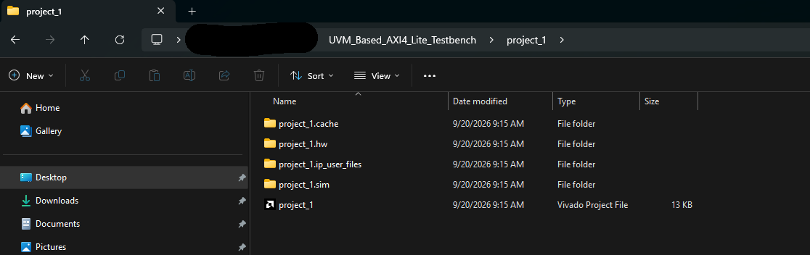
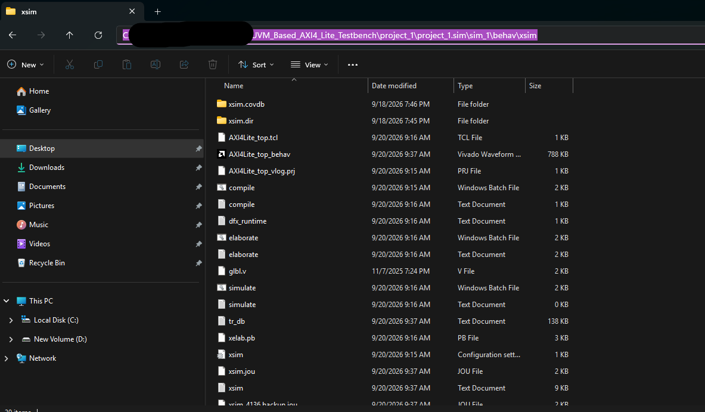
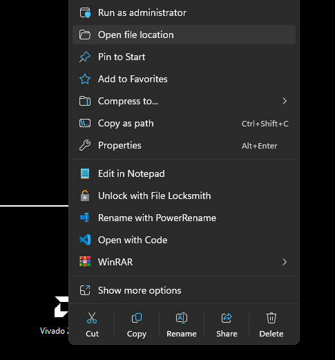
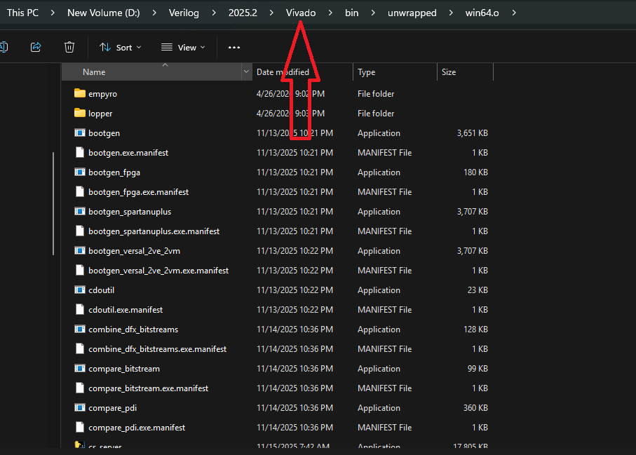
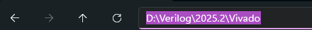
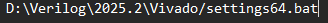
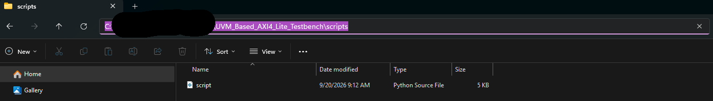
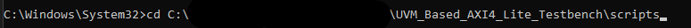
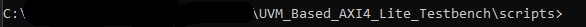
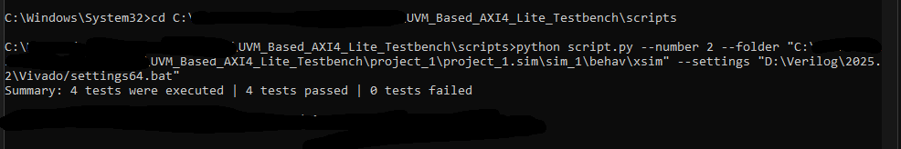

# Running the regression script: step-by-step guide

This guide shows how to run `scripts/script.py` from the Windows command prompt. You need two paths for it: the folder with the compiled simulation, and Vivado's `settings64.bat`. The steps below show where to find both.

> **Requirements:** Windows, Vivado (tested with 2025.2), Python 3.
> The screenshots have part of the path blacked out. Yours will start with wherever you placed the repository.

---

## 1. Create the Vivado project and run the simulation once

The script re-runs a simulation that Vivado has already compiled, so this step has to be done once, before the first use.

1. Create a Vivado project and add the sources **exactly as described in [How to run](../README.md#how-to-run)** in the main README.
   Add only the four files listed there as simulation sources. Adding the individual class files as well makes them compile twice, and the build fails.
2. Run the behavioral simulation once.

> After any change to a `.sv` or `.v` file, run the simulation from Vivado again. Otherwise the script keeps running the old compiled version.

---

## 2. Find the `--folder` path (the `xsim` folder)

1. Open the folder of your Vivado project.

   

2. Go to `<project_name>.sim` → `sim_1` → `behav` → `xsim`.
3. Check that you are in the right folder: it must contain `xsim.dir`.
4. Click the address bar, copy the path and keep it for step 5.

   

> The path in the screenshot only matches yours if you created the Vivado project inside the repository folder, as done here.

---

## 3. Find the `--settings` path (`settings64.bat`)

1. Right-click the Vivado shortcut (on the desktop or in the Start menu) and choose **Open file location**.

   

2. This opens `...\Vivado\bin\unwrapped\win64.o`. Go **three levels up**, to the `Vivado` folder (the arrow in the screenshot).

   

3. Check that this folder contains `settings64.bat`.
4. Copy the folder path from the address bar.

   

5. Add `\settings64.bat` to the end of the path and keep it for step 5.

   

---

## 4. Open a command prompt in the `scripts` folder

**Option A (simplest):** open the repository's `scripts` folder in File Explorer, click the address bar, type `cmd` and press Enter. A command prompt opens directly in that folder.

**Option B:** copy the path of the `scripts` folder from the address bar,



then open a command prompt (no administrator rights needed) and type:

```
cd /d "<path you copied>"
```



The `/d` switch also changes the drive, which you need if the repository is on a different drive than the one cmd starts on.

The prompt should now end in `\scripts>`:



---

## 5. Run the script

```
python script.py --number <number of seeds> --folder "<xsim folder path>" --settings "<settings64.bat path>"
```

- Each seed runs **both** tests (`AXI4Lite_test` and `AXI4Lite_ral_test`), so `--number 100` means 200 simulations.
- Keep the double quotes around both paths. Paths with spaces don't work without them.
- Close any simulation still open in Vivado first.



When the script finishes, the terminal shows the total count. Detailed results are in the `logs` folder at the repository root:

- `logs/summary.txt`: PASS / FAIL for every simulation, with its test name and seed
- `logs/errors.txt`: the UVM messages of every simulation that didn't pass

If an argument is wrong (the folder doesn't exist, the settings file is missing or misnamed, or `--number` is below 1), the script stops with a message before running anything, and the logs from the previous run are kept.
